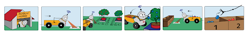
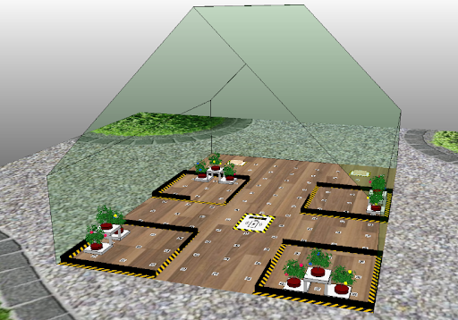
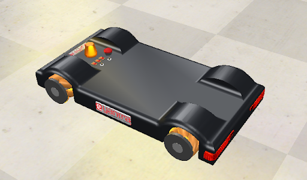

<h1>Berryminator (BM) Theme  eYRC 2021-22</h1>

### Theme Description
To simulate an automated robot in CoppeliaSim that traverses an urban farming scenario to pluck berries and deposit them in designated sections.

### Learning Objectives for students
- Robotic Simulation
- Robotic Arm Design and Manipulation 
- Plucking and Depositing Mechanism
- Image Processing
- Navigation and Path Planning
- Control Systems
- Python and Lua Programming

 
 <b>(a) Simulation Arena layout (Left)  (b) Robot Model used (Right) </b>

*The final goal of the Berryminator theme was to collect fruits from different plants placed in the simulated arena. The robot model in (b) was provided to the teams. The teams in the competition had to construct a robotic arm on top of the robot and implement the programming of the whole setup in python and lua to implement the final goal.*

